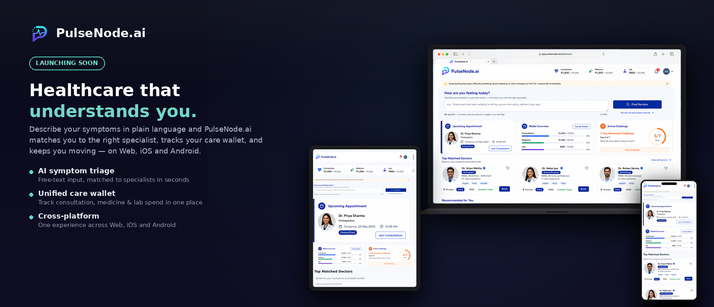

  

<h1 align="center">PulseNode.ai</h1>

  <strong>The corporate health-benefits platform that puts care back in employee care.</strong>

---

## What Your Employees See First

**Describe symptoms. Get matched. Book care.**

An employee types *"persistent cough and low-grade fever for 3 days"* — PulseNode's AI instantly routes them to the right specialty from your onboarded doctor network. No medical jargon. No guesswork. Emergency keywords (chest pain, difficulty breathing, severe bleeding) bypass AI entirely and surface urgent-care guidance instantly.

From there, they browse **doctor cards** showing photo, name, specialty, education, languages, city, and consultation mode — and book **online (in-app chat)** or **offline (in-person, city-matched)** in one flow.

  

---

## Why Companies Choose PulseNode.ai

| The Old Way | PulseNode.ai |
|-------------|--------------|
| Employees don't know their coverage | **Benefits RAG Assistant** — company-scoped, policy-grounded Q&A that cites sources and admits when it doesn't know |
| "Which specialist do I need?" | **Symptom-based matching** — closed-set specialty routing, validated server-side, never diagnosis |
| Fragmented tools for doctors | **Doctor portal** — profile, availability, clinic, earnings, withdrawals in one place |
| Admins buried in spreadsheets | **Company admin dashboard** — bulk import, explicit policy assignment, real-time utilization reports |
| Platform ops = code deploys | **Hot-reloadable config** — cancellation windows, fee %, wallet limits, notification templates, AI flags — all editable without a redeploy |
| Phantom balances, audit nightmares | **Ledger-based wallets** — append-only transactions, derived balances, year-end snapshots preserve unclaimed benefits |
| One-size-fits-all policies | **Tiered policy configuration** — sum insured, floater/individual, lump-sum vs. per-illness, CTC bands for grouping, room-rent limits, co-pay %, waiting periods |

---

## Three Annual Wallets. Total Transparency.

| Category | What It Covers |
|----------|----------------|
| 🩺 **Consultations** | Doctor fees (online & offline) |
| 💊 **Medicines** | Prescription costs — structured, multi-medicine, dosage/frequency/duration/instructions |
| 🧪 **Lab Tests** | Diagnostic spend |

Employees see every transaction: debits, top-ups (Razorpay, webhook-verified), refunds, year-end snapshots. No mystery deductions.

---

## Built for the Way You Operate

**Four surfaces. One API. Zero leakage.**

| Surface | Auth | Scope |
|---------|------|-------|
| **Employee App** | Firebase ID token (corporate email) | Own wallet, appointments, prescriptions, policies |
| **Doctor Portal** | Firebase ID token (Google/email) | Own profile, appointments, patients, earnings |
| **Company Admin** | Firebase ID token (maintainer role) | Company employees, policies, wallets, reports |
| **Platform Admin** | Firebase ID token (platform role) | Full-system visibility, config, approvals, audit |

**Company-scoped queries live at the database layer** — never in prompt instructions. RAG retrieval filters by `company_id` in the vector query itself.

**No CTC stored. Ever.** Policy assignment is explicit employer choice — single or bulk multi-select. Unassigned employees stay visible so nothing falls through the cracks.

---

## Security & Compliance — Built In

- **Token-based auth everywhere** — no cookies, no sessions in the API layer
- **PHI-aware logging** — chat bodies, prescription contents never logged above `debug`
- **Webhook-verified payments** — Razorpay HMAC verified server-side before wallet credit
- **Idempotency keys** — every wallet transaction, top-up, refund carries a key — safe retries, no double-charge
- **Append-only audit trails** — wallet ledger, doctor earnings ledger, expiry snapshots, policy versions, maintainer actions
- **Maintainer RBAC** — Admin / Maintainer / Read-only per company; last admin protected; email-unique per company

---

## Proven at Scale

| Endpoint | Target |
|----------|--------|
| Wallet balance query | 1,000 RPS, p95 < 100ms |
| Wallet top-up | 200 RPS, p95 < 200ms |
| Company wallet reports | 500 RPS, p95 < 150ms |
| Doctor matching | 500 RPS, p95 < 300ms |
| Benefits RAG query | 200 RPS, p95 < 500ms |
| Appointment booking | 300 RPS, p95 < 400ms |

**No mocks in integration tests.** Real test database, real transactions, real rollbacks.

<!-- ---

## Pilot Program — Q3/Q4 2026

We're running **design partnerships with 5 forward-thinking companies** (200–5,000 employees).

**You get:**
- Dedicated environment with your policies, doctor network, and employee data
- White-glove onboarding (CSV import, policy config, doctor onboarding)
- Direct access to product & engineering for feedback loops
- Early access to gamification, recommendation engine, and advanced analytics
- Preferred pricing at GA

**We need:**
- A benefits champion internally
- Willingness to run an 8–12 week pilot with real employees
- Bi-weekly 30-min feedback sync

[👉 Apply for the Pilot Program →](/pilot-application) -->

---

## Connect

- **Website:** [pulsenode.ai](https://pulsenode.ai)
- **LinkedIn:** [linkedin.com/company/pulsenode-ai](https://linkedin.com/company/pulsenode-ai)
- **Twitter/X:** [@pulsenodeai](https://twitter.com/pulsenodeai)
- **Email:** hello@pulsenode.ai

---

  <strong>PulseNode.ai</strong> — Corporate health benefits that work for everyone. 
  <em>Employees. Doctors. Admins. Platform.</em>

